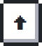
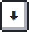
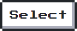

<!-- <pre>
      ___           ___           ___       ___       ___
     /\__\         /\  \         /\__\     /\__\     /\  \
    /:/  /        /::\  \       /:/  /    /:/  /    /::\  \
   /:/__/        /:/\:\  \     /:/  /    /:/  /    /:/\:\  \
  /::\  \ ___   /::\~\:\  \   /:/  /    /:/  /    /:/  \:\  \
 /:/\:\  /\__\ /:/\:\ \:\__\ /:/__/    /:/__/    /:/__/ \:\__\
 \/__\:\/:/  / \:\~\:\ \/__/ \:\  \    \:\  \    \:\  \ /:/  /
      \::/  /   \:\ \:\__\    \:\  \    \:\  \    \:\  /:/  /
      /:/  /     \:\ \/__/     \:\  \    \:\  \    \:\/:/  /
     /:/  /       \:\__\        \:\__\    \:\__\    \::/  /
     \/__/         \/__/         \/__/     \/__/     \/__/

<strong> Welcome~ </strong>
</pre> -->

## 🎮 Play Github Together~

<table>
<tr>
    <th></th>
  </tr>
</table>
 

 

 
 
 
