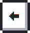

<h1> Hey</h1>

<pre>
      ___           ___           ___       ___       ___     
     /\__\         /\  \         /\__\     /\__\     /\  \    
    /:/  /        /::\  \       /:/  /    /:/  /    /::\  \   
   /:/__/        /:/\:\  \     /:/  /    /:/  /    /:/\:\  \  
  /::\  \ ___   /::\~\:\  \   /:/  /    /:/  /    /:/  \:\  \ 
 /:/\:\  /\__\ /:/\:\ \:\__\ /:/__/    /:/__/    /:/__/ \:\__\
 \/__\:\/:/  / \:\~\:\ \/__/ \:\  \    \:\  \    \:\  \ /:/  /
      \::/  /   \:\ \:\__\    \:\  \    \:\  \    \:\  /:/  / 
      /:/  /     \:\ \/__/     \:\  \    \:\  \    \:\/:/  /  
     /:/  /       \:\__\        \:\__\    \:\__\    \::/  /   
     \/__/         \/__/         \/__/     \/__/     \/__/    

<strong>Welcome to my GitHub profile.</strong>
</pre>

## 🎮 Let's play github together~

 

 
 
 
